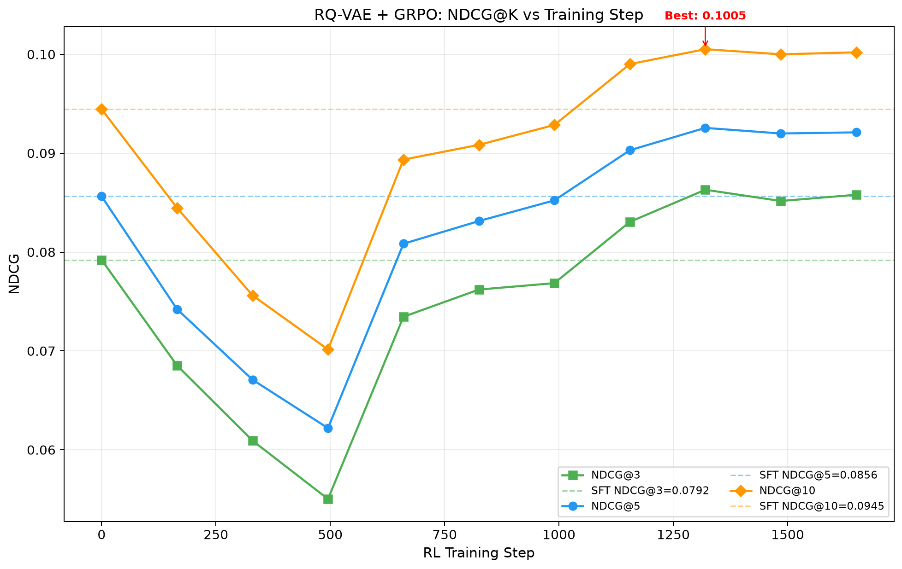
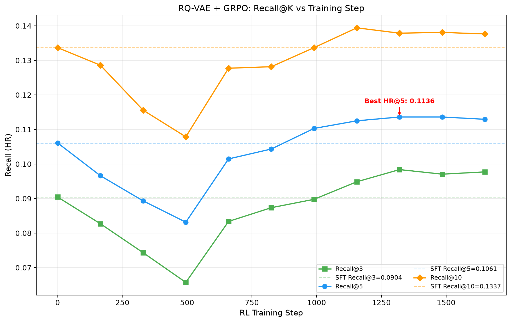
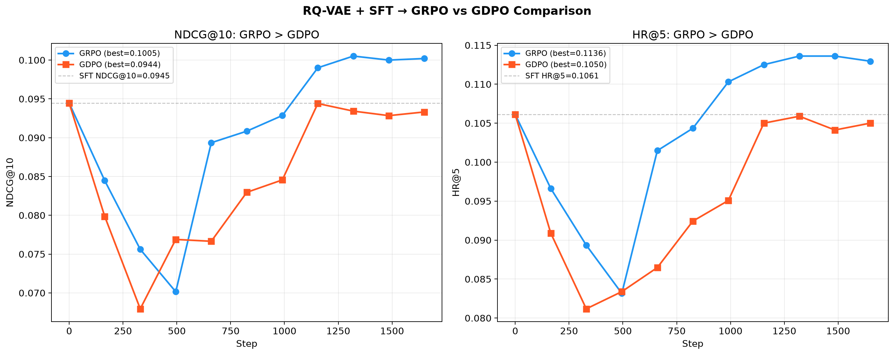
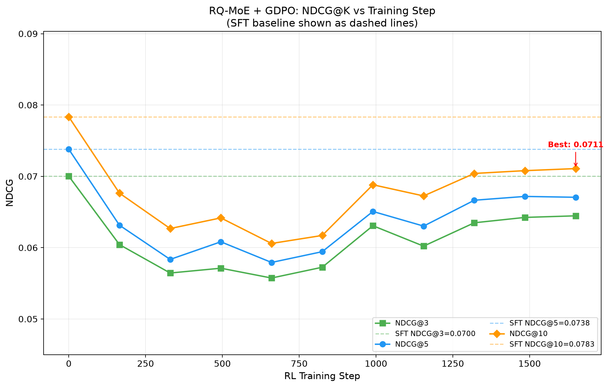
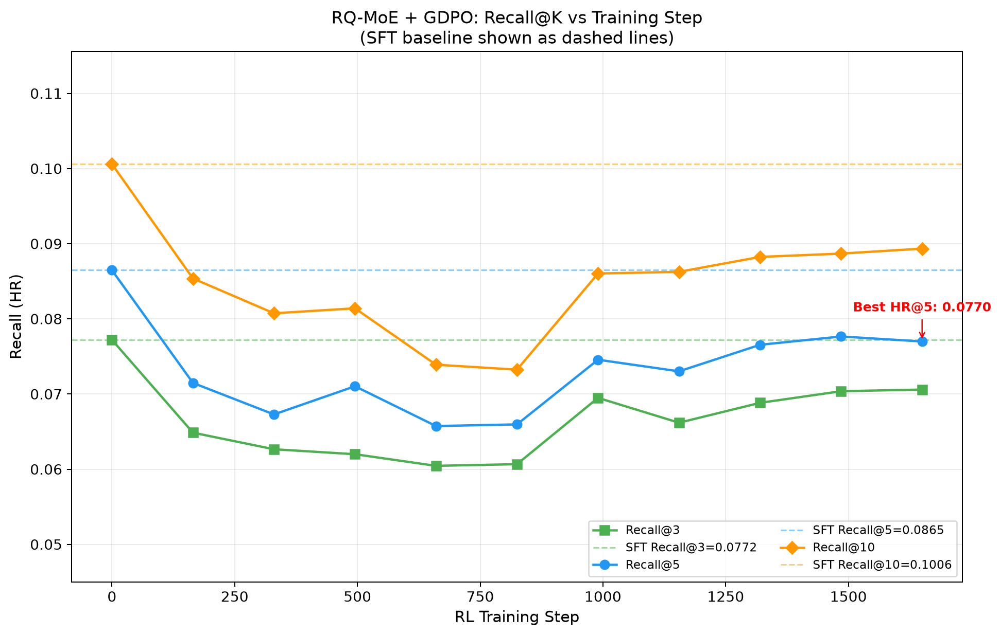

# MiniOneRec Reproduction

[](https://huggingface.co/onesfour/MiniOneRec-1.5B-SFT-GDPO)

> **生成式推荐系统复现与改进** — 基于 [MiniOneRec](https://github.com/AkaliKong/MiniOneRec) 的完整复现，额外尝试了 RQ-MoE 码本构建与 GDPO 强化学习优化。

本仓库在 **Qwen2.5-1.5B + 单卡 48G** 环境下，实现生成式推荐全流程：

```
文本嵌入 → SID 构建 → 数据转换 → SFT → RL(GRPO/GDPO) → 评测
```

## 项目来源

| 来源 | 链接 | 说明 |
|------|------|------|
| 原始论文/仓库 | [AkaliKong/MiniOneRec](https://github.com/AkaliKong/MiniOneRec) | MiniOneRec 原版实现 |
| 复现参考 | [SuFame920/MiniOneRec-Reproduction](https://github.com/SuFame920/MiniOneRec-Reproduction) | 单卡复现参考 |
| RQ-MoE 源码 | [KDEGroup/RQ-MoE](https://github.com/KDEGroup/RQ-MoE) | 残差量化 MoE 方法 |
| GDPO 源码 | [NVlabs/GDPO](https://github.com/NVlabs/GDPO) | Group reward-Decoupled PPO |

## HuggingFace 模型

| 目录 | 内容 | 说明 |
|------|------|------|
| [`sft_model/`](https://huggingface.co/onesfour/MiniOneRec-1.5B-SFT-GDPO/tree/main/sft_model) | RQ-VAE SFT 模型 | 可直接 from_pretrained 加载 |
| [`gdpo_best_checkpoint-1155/`](https://huggingface.co/onesfour/MiniOneRec-1.5B-SFT-GDPO/tree/main/gdpo_best_checkpoint-1155) | GDPO 最优 checkpoint | step 1155 |
| [`data/`](https://huggingface.co/onesfour/MiniOneRec-1.5B-SFT-GDPO/tree/main/data) | 数据集文件 | .npy / .npz / .csv 等 |

## 快速开始

### 1. 环境安装

```bash
conda create -n MiniOneRec python=3.11 -y && conda activate MiniOneRec
bash scripts/install_deps.sh
```

关键依赖: `torch==2.6.0`, `transformers==4.57.1`, `trl==0.24.0`, `deepspeed==0.18.0`, 单卡 >= 48G。

### 2. 下载数据文件 (必须)

从 [HuggingFace data/](https://huggingface.co/onesfour/MiniOneRec-1.5B-SFT-GDPO/tree/main/data) 下载全部大文件，按原目录结构放入 `data/Amazon/`：

```
data/Amazon/
├── index/
│   ├── *.emb-qwen-td.npy              # 从 HF 下载
│   ├── *.codebooks_constrained.npz    # 从 HF 下载
│   ├── *.index.json                   # 仓库已包含
│   ├── *.item.json                    # 仓库已包含
│   └── *.inter                        # 从 HF 下载
├── train/   *.csv                     # 从 HF 下载
├── valid/   *.csv                     # 从 HF 下载
├── test/    *.csv                     # 从 HF 下载
└── info/    *.txt                     # 仓库已包含
```

### 3. 下载 Qwen2.5-1.5B 基础模型

```bash
python scripts/download_models.py   # → models/Qwen2.5-1.5B/
```

### 4. 下载训练好的模型权重 (可选)

从 HF 下载 `sft_model/` 全部文件至 `output/sft/` 目录。目录结构详见 `output/sft/README.md`。

### 5. 运行实验 (四选一)

| 脚本 | SID 方法 | RL 方法 | 说明 |
|------|---------|--------|------|
| `scripts/run_rqvae_sft_grpo.sh` | RQ-VAE | **GRPO** | Baseline — 最优方案 |
| `scripts/run_rqvae_sft_gdpo.sh` | RQ-VAE | GDPO | GRPO vs GDPO |
| `scripts/run_rqmoe_sft_grpo.sh` | RQ-MoE V2 | GRPO | RQ-MoE SID 对比 |
| `scripts/run_rqmoe_sft_gdpo.sh` | RQ-MoE V2 | GDPO | 完整改进 |

```bash
bash scripts/run_rqvae_sft_grpo.sh   # 一键运行: SID → SFT → RL → 评测
```

---

## 实验结果

### RQ-VAE + GRPO (Baseline)

| 指标 | SFT | GRPO (best, step=1320) | Δ% |
|------|-----|------------------------|-----|
| HR@3 | 0.0904 | **0.0984** | +8.9% |
| NDCG@3 | 0.0792 | **0.0863** | +8.9% |
| HR@5 | 0.1061 | **0.1136** | +7.1% |
| NDCG@5 | 0.0856 | **0.0926** | +8.2% |
| HR@10 | 0.1337 | **0.1379** | +3.1% |
| NDCG@10 | 0.0945 | **0.1005** | +6.4% |

<p align="center">
  
  
</p>

### GRPO vs GDPO

| 指标 | GRPO (best) | GDPO (best) | GRPO - GDPO |
|------|-------------|-------------|--------------|
| HR@5 | **0.1136** | 0.1059 | +0.0077 |
| NDCG@5 | **0.0926** | 0.0882 | +0.0044 |
| NDCG@10 | **0.1005** | 0.0944 | +0.0061 |

<p align="center">
  
</p>

> **结论**: GRPO 显著超越 SFT (+6.4% NDCG@10)；GDPO 在推荐场景（rule_reward 命中率 ~2%）下未能超越 SFT。详细分析见 [`analysis/GRPO_vs_GDPO.md`](analysis/GRPO_vs_GDPO.md)。

### RQ-MoE + GDPO (改进方案)

| 指标 | SFT | GDPO (best, step=1155) |
|------|-----|------------------------|
| HR@5 | 0.1061 | 0.1050 |
| NDCG@10 | 0.0945 | 0.0944 |

<p align="center">
  
  
</p>

### 与原始论文 Baseline 对比

| 方法 | HR@5 | NDCG@10 |
|------|------|---------|
| SASRec | 0.0909 | 0.0806 |
| TIGER | 0.1010 | 0.0908 |
| D3 | 0.1213 | 0.1082 |
| MiniOneRec (7B, paper) | 0.1321 | 0.1167 |
| **Ours (1.5B, GRPO)** | **0.1136** | **0.1005** |

完整逐 checkpoint 数据: [`results/baseline_grpo/`](results/baseline_grpo/), [`results/baseline_gdpo/`](results/baseline_gdpo/)。

---

## 项目结构

```
MiniOneRec/
├── README.md
├── requirements.txt
├── .gitignore
│
├── config/
│   └── zero2_opt.yaml                 # DeepSpeed ZeRO-2
│
├── data/Amazon/                       # 数据集 (大文件从 HF 下载)
│   ├── index/   *.json *.npy *.npz    # SID 构建文件
│   ├── train/   *.csv                 # 训练集
│   ├── valid/   *.csv                 # 验证集
│   ├── test/    *.csv                 # 测试集
│   └── info/    *.txt                 # SID↔Title
│
├── output/                            # 模型存放 (从 HF 下载或训练产出)
│   ├── sft/   README.md               # SFT 模型
│   └── rl/    README.md               # RL checkpoints
│
├── analysis/                          # 文档
│   ├── RUN.md / MONITOR.md            # 运行与监控指南
│   ├── experiment_plan.md             # 实验方案
│   └── GRPO_vs_GDPO.md                # 对比分析
├── paper/                             # 优化方案分析
│   ├── sid_opt.md                     # RQ-MoE 码本优化
│   └── rl_opt.md                      # GDPO RL 优化
│
├── reference/                         # 参考实现
│   ├── RQ-MoE/                        # 原版 RQ-MoE
│   └── GDPO/                          # GDPO (trl + verl)
│
├── rq/                                # SID 码本构建
│   ├── models/                        # RQ-VAE, RQ-MoE V1/V2
│   ├── rqkmeans_constrained.py        # Constrained K-Means
│   ├── rqkmeans_plus.py               # RQ-KMeans++ 训练
│   ├── train_rqmoe_v2.py              # RQ-MoE V2
│   ├── generate_indices_plus.py       # RQ-VAE SID 生成
│   ├── text2emb/                      # 文本→嵌入
│   └── rqmoe_collapse_analysis.md     # 码本坍塌分析
│
├── scripts/                           # 启动脚本 (4 in 1)
│   ├── run_rqvae_sft_grpo.sh          # Baseline
│   ├── run_rqvae_sft_gdpo.sh
│   ├── run_rqmoe_sft_grpo.sh
│   ├── run_rqmoe_sft_gdpo.sh
│   ├── install_deps.sh
│   └── download_models.py
│
├── tools/                             # 评测工具
├── results/                           # 评测结果 (含逐 checkpoint JSON)
├── assets/                            # 图片
│
├── sft.py / sft.sh                    # SFT 训练
├── rl.py / rl.sh                      # RL 训练 (GRPO/GDPO)
├── minionerec_trainer.py              # GRPO/GDPO 核心实现
├── evaluate.py / evaluate.sh          # 评测
└── data.py                            # 数据集类
```

---

## RQ-MoE 码本坍塌分析

RQ-MoE 替代 RQ-VAE 后 Level 0 码本完全坍塌：

| 方法 | Level 0 利用率 | Level 1 | Level 2 | 有效 SID 组合 |
|------|---------------|---------|---------|-------------|
| RQ-VAE | **256/256** | 256/256 | 256/256 | ~16.7M |
| RQ-MoE V1 | 1/256 | 256/256 | 256/256 | ~65K |

**根因**: `torch.no_grad()` 截断梯度 + e_dim=64 (40x 压缩) + 零初始化 encoder。详见 [`rq/rqmoe_collapse_analysis.md`](rq/rqmoe_collapse_analysis.md)。

---

## 硬件要求

- **GPU**: 单卡 >= 48G (A6000 / 3090 / L40S)
- **RAM**: >= 64 GB
- **磁盘**: >= 150 GB

## 引用

```bibtex
@misc{kong2025minionerec,
    title={MiniOneRec: An Open-Source Framework for Scaling Generative Recommendation},
    author={Xiaoyu Kong et al.}, year={2025}, eprint={2510.24431},
}
@misc{zhong2026rqmoe,
    title={RQ-MoE: Residual Quantization via Mixture of Experts},
    author={Zhengjia Zhong et al.}, year={2026}, eprint={2605.14359},
}
@misc{liu2026gdpo,
    title={GDPO: Group reward-Decoupled Normalization Policy Optimization},
    author={Shih-Yang Liu et al.}, year={2026}, eprint={2601.05242},
}
```

## 致谢

- [AkaliKong/MiniOneRec](https://github.com/AkaliKong/MiniOneRec) — 原始框架
- [SuFame920/MiniOneRec-Reproduction](https://github.com/SuFame920/MiniOneRec-Reproduction) — 单卡复现参考
- [KDEGroup/RQ-MoE](https://github.com/KDEGroup/RQ-MoE) / [NVlabs/GDPO](https://github.com/NVlabs/GDPO) — 参考实现
